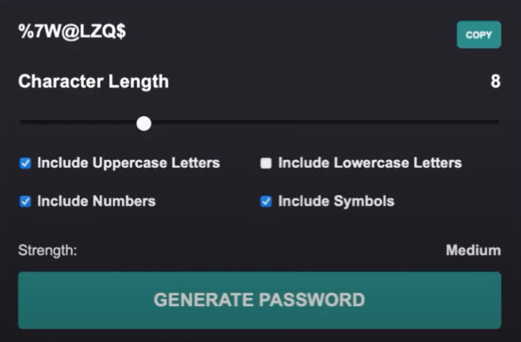

# Password Generator Web Application with React

## Description:

Build a web application that enables users to generate passwords according to their preferences.

Features:

1. Password Display: Show a generated password inside a div element, such as "OPse#R%". Add a "Copy" button on the right side of the text to allow users to copy the generated password to the clipboard.

2. Length Slider: Include a slider below the password display to control the length of the generated password. The default value should be set to 4, but users can adjust it according to their desired length.

3. Character Type Selection: Provide checkboxes for users to choose which character types should be included in the generated password. Options should include uppercase letters, lowercase letters, numbers, and symbols.

4. Password Strength Indicator: Display a div element below the password generator section to show the password strength. The indicator can be a visual representation, such as a progress bar or a text description, to inform users about the strength of the generated password.

By implementing these features, users will be able to generate passwords based on their preferences, customize the password length, select desired character types, and get feedback on the strength of the generated password.
